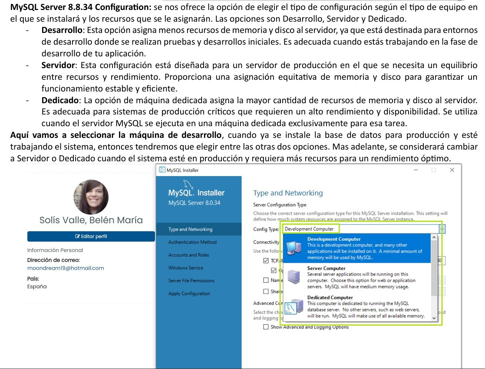

# 📚 Tarea 1: Instalación y Primeros Pasos con MySQL y Oracle

> Guía práctica de instalación y configuración de bases de datos para DAW.

## 📄 Tabla de Contenidos
- [Descripción](#descripción)
- [Contenido](#contenido)
- [Objetivo](#objetivo)
- [Requisitos Previos](#requisitos-previos)
- [Autoría](#autoría)

---

## 📝 Descripción
Este repositorio contiene el informe completo en PDF sobre la Tarea 1 del módulo de Bases de Datos (DAW). 

El objetivo es servir de guía práctica y visual para instalar y realizar los primeros pasos en dos gestores de bases de datos ampliamente utilizados: MySQL Community Server y Oracle Database Express Edition.

Esta tarea documenta cómo instalar y configurar **MySQL Community Server** y **Oracle Express Edition** desde cero, usando capturas y explicaciones detalladas.

## 📦 Contenido

- Guía paso a paso para instalar MySQL y Oracle en Windows
- Configuración inicial: creación de usuarios, establecimiento de contraseñas y permisos básicos
- Uso de herramientas gráficas: conexión y primeros pasos con MySQL Workbench y Oracle SQL Developer
- Capturas de pantalla explicativas de cada uno de los pasos

## 🎯 Objetivo

El documento ayuda a:

- Instalar los motores de bases de datos recomendados para uso académico y personal
- Crear y gestionar usuarios en ambos sistemas
- Familiarizarse con el entorno visual y la línea de comandos de cada gestor
- Sentar las bases para trabajos y ejercicios posteriores en el módulo de Bases de Datos

## ⚙️ Requisitos Previos

- Windows OS
- Conexión a internet

## 👩‍💻 Autoría

Belén María Solís Valle  
DAW - 2023/2024
 
---

## 🖼️ Ejemplo de Captura
