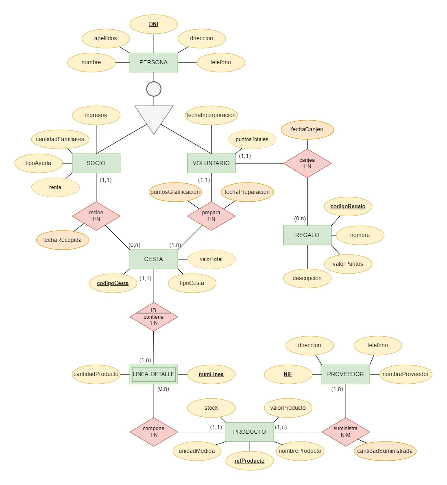
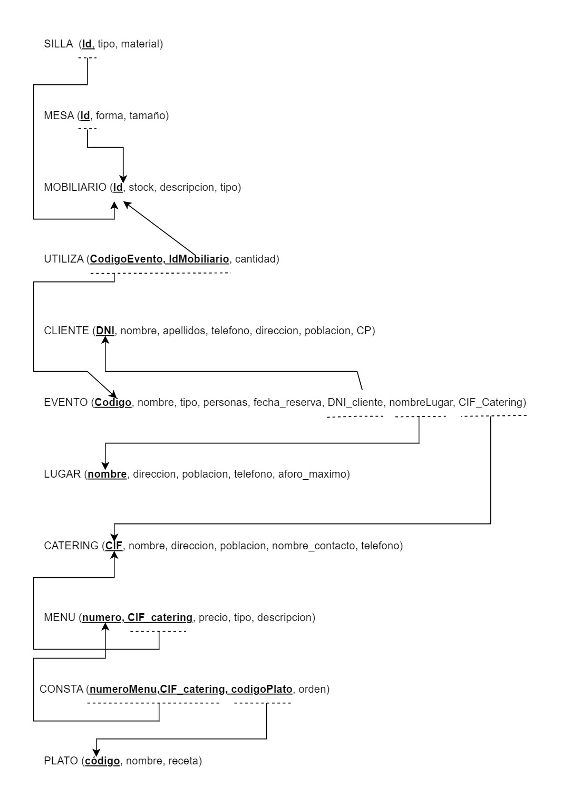

# 📚 Tarea 2: Bases de Datos Relacionales

> Documentación del modelado de bases de datos para dos casos prácticos: una ONG “Cesta Solidaria” y una empresa organizadora de eventos.

## 📄 Tabla de Contenidos

- [Descripción](#descripcion)
- [Parte 1: Diagrama Entidad-Relación - ONG Cesta Solidaria](#parte-1-ong)
- [Parte 2: Modelo Relacional - Empresa Organizadora de Eventos](#parte-2-eventos)
- [Objetivos](#objetivos)
- [Archivos incluidos](#archivos-incluidos)
- [Autoría](#autoria)

---

<h2 id="descripcion">📝 Descripción</h2>

Esta tarea consta de dos partes basadas en dos casos prácticos propuestos para diseñar modelos de bases de datos relacionales.  
- El primer caso práctico se centra en la elaboración de un Diagrama Entidad-Relación de la ONG Cesta Solidaria.  
- El segundo caso práctico se práctico se proporciona el Diagrama Entidad-Relación de una empresa organizadora de eventos y se procede a la normalización y representación gráfica del modelo relacional con sus correspondientes tablas.

---

<h2 id="parte-1-ong">🛠 Parte 1: Diagrama Entidad-Relación - ONG Cesta Solidaria</h2>

- Identificación y análisis de los elementos clave del diagrama E/R: entidades, relaciones y atributos.  
- Selección de claves candidatas y determinación de claves primarias.  
- Estudio de cardinalidades para definir las relaciones entre las entidades.  
- Representación gráfica detallada del modelo E/R elaborado.

---

<h2 id="parte-2-eventos">🧩 Parte 2: Modelo Relacional - Empresa Organizadora de Eventos</h2>

- Presentación y análisis del diagrama E/R de una empresa organizadora de eventos.  
- Transformación del diagrama en un modelo relacional, con el paso a tablas de entidades, atributos y relaciones según cardinalidades.  
- Normalización y representación gráfica del modelo relacional final con tablas bien estructuradas.

---

<h2 id="objetivos">🎯 Objetivos</h2>

- Comprender la lógica, el diseño conceptual y físico de bases de datos relacionales.  
- Aplicar técnicas para elaborar diagramas E/R y convertirlos en esquemas relacionales normalizados.  
- Manejar jerarquías, entidades fuertes y débiles, y las relaciones que se establecen entre ellas.

---

<h2 id="archivos-incluidos">📂 Archivos incluidos</h2>

- Documento PDF completo de la tarea.  
- Imagen del diagrama E/R del caso práctico de la ONG Cesta Solidaria.  
- Representación gráfica del modelo relacional de las tablas de la empresa organizadora de eventos.

---

<h2 id="autoria">👩‍💻 Autoría</h2>

Belén María Solís Valle  
DAW - 2023/2024
