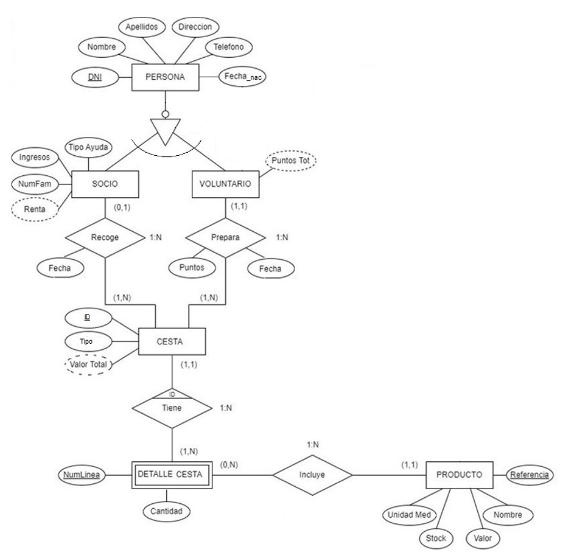
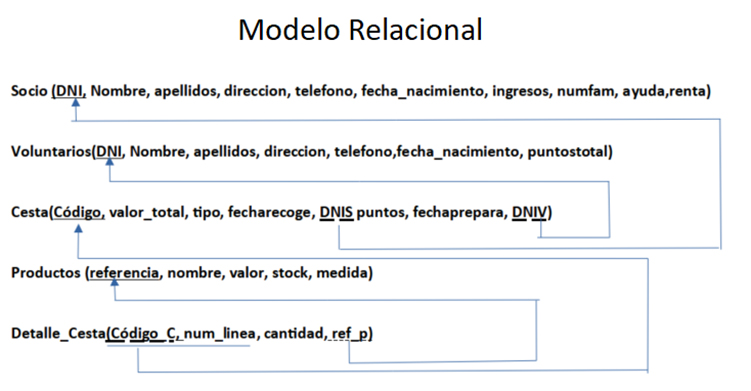

# 📘 Tarea 5: Tratamiento de Datos

> Práctica avanzada de manipulación y tratamiento de datos en SQL sobre la base de datos relacional de la ONG **AyudaSolidaria**.

## 📄 Tabla de Contenidos  
- [Descripción](#descripcion)  
- [Archivos incluidos](#archivos-incluidos)  
- [Instrucciones de uso](#instrucciones-de-uso)  
- [Resumen de ejercicios](#resumen-de-ejercicios)  
- [Esquema Entidad/Relación](#esquema-entidad-relacion)  
- [Modelo Relacional](#modelo-relacional)  
- [Autoría](#autoría)

## <h2 id="descripcion">📝 Descripción</h2>

En este tema se trabaja con la base de datos relacional **“AyudaSolidaria”**.

El objetivo principal es realizar operaciones avanzadas de **tratamiento y manipulación de datos** mediante instrucciones SQL, incluyendo inserciones, actualizaciones, borrados, subconsultas, agrupaciones, vistas, transacciones y bloqueo de tablas.

La tarea incluye:

- Script de creación e inserción de datos  
- Desarrollo de todos los ejercicios  
- Documento PDF con explicaciones, resultados y correcciones del profesor  

---

## <h2 id="archivos-incluidos">📂 Archivos incluidos</h2>

- `ScriptTarea5_2324.sql` — Script inicial para crear la base de datos y cargar los datos.
- `Solis_Valle_Belen_Maria_BD_Tarea5.sql` — Script con todas las consultas y ejercicios resueltos.
- `Solis_Valle_Belen_Maria_BD_Tarea5_Corregida.pdf` — Informe con los resultados, capturas y correcciones.

---

## <h2 id="instrucciones-de-uso">🛠 Instrucciones de uso</h2>

1. **Ejecuta** `ScriptTarea5_2324.sql` en tu gestor MySQL para crear la base de datos y sus registros iniciales.  
2. **Abre y ejecuta** las consultas de `Solis_Valle_Belen_Maria_BD_Tarea5.sql` para ver la resolución de los ejercicios.  
3. **Consulta** `Solis_Valle_Belen_Maria_BD_Tarea5_Corregida.pdf` para comparar resultados y revisar correcciones.  

---

## <h2 id="resumen-ejercicios">📋 Resumen de ejercicios</h2>

La tarea incluye ejercicios como:

- **Inserción** de nuevos registros (socios, voluntarios, cestas, etc.)
- **Actualización** de valores mediante `UPDATE` con condiciones complejas.
- **Eliminación** de datos respetando integridad referencial.
- Consultas avanzadas con:
  - `GROUP BY`
  - `HAVING`
  - Funciones agregadas
  - Subconsultas
- Cálculo de rankings, puntuaciones o indicadores basados en consultas previas.
- **Transacciones** con `COMMIT` y `ROLLBACK`.
- **Bloqueo de tablas** para operaciones de concurrencia.
- Verificación final con consultas y capturas desde **MySQL Workbench**.

Cada ejercicio está completamente documentado en el PDF, con explicación y resultado esperado.

---

## <h2 id="esquema-entidad-relacion">📜 Esquema Entidad/Relación</h2>

⚠️ *Este tema parte del mismo esquema que la Tarea 4 (Cesta Solidaria), así que se incluye como referencia visual.*

## <h2 id="modelo-relacional">📑 Modelo Relacional</h2>

---

## <h2 id="autoria">👩‍💻 Autoría</h2>

Belén María Solís Valle  
DAW – Curso 2023/2024
